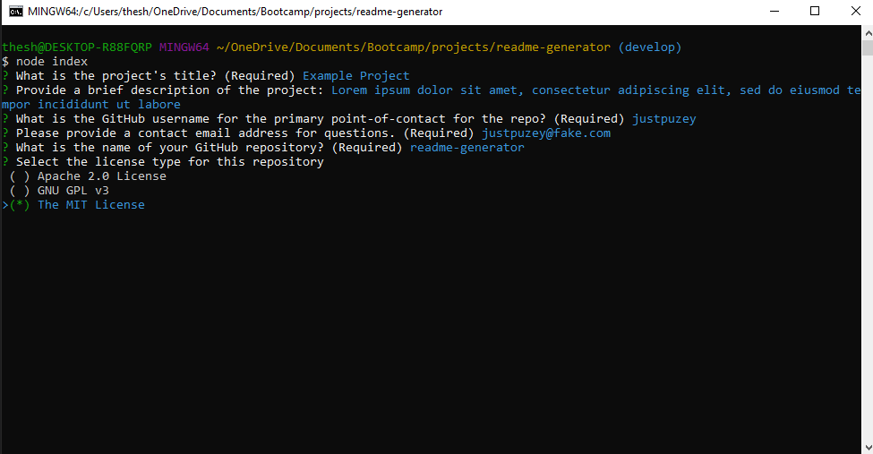

# README.md Generator

## Description 

 Projects depend on README files as a simple and clean way to provide information about thier project. Having a solid README helps to communicate how to install, report issues and will increase the chances that others will want to contribute to the project.

 This application is run using Node.js and the Enquirer module to prompt the user with questions related to the project to generate a professional README.md file

  ## Table of Contents
* [Installation](#installation)
* [Usage](#usage)
* [License](#license)
* [Questions](#questions)
  

## Installation

*Steps required to install project and how to get the development environment running:*

* The README.md generator is dependant on the Inquirer command-prompt module.
* Begin by installing Inquirer by running the command: `npm install inquirer`  Please visit https://www.npmjs.com/package/enquirer for additional installation information.

## Usage 

*Instructions and examples for use:*

Click to watch walk-through video => [`Demo Video`](https://drive.google.com/file/d/1-mfL-XK1bvRn-4GNU47uHqI3CupaOZJw/view?usp=sharing)

Check out the [`ExampleREADME.md`](./utils/example-README.md)

* Invoke the application with the command: `node index.js`.
* The application utilizes the `inquirer` package to prompt the user in the command line with questions related to the projeject
* License: question six provides a list of possible licenses, navigate by using arrow keys and select the proper license using the space bar
* The application will then take the responses to the questions to generate a custom markdown page
* The generated page will be contained in the `dist` folder

`For full walk-through video, select link above`

`Screen-capture of prompts in node.js`

`Screen-capture of output README.md`

## Contributors

Justin Puzey

## License

MIT License

---

## Questions?

*If you have any quewstions, please contact me using the information below.*

GitHub: justpuzey

Email: justpuzey@gmail.com